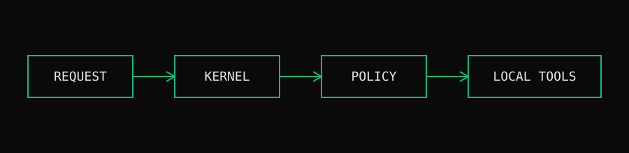
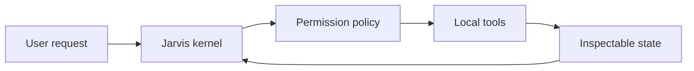

# Jarvis

Jarvis is a local-first agent runtime for composing reliable tool loops,
structured inputs, and observable model interactions. The project keeps the
runtime close to the developer while leaving room for explicit permissions,
replayable actions, and inspectable state.

## Direction

The project focuses on making agent behavior understandable and controllable:

- inputs are structured before tools are invoked;
- permissions are evaluated against the requested action;
- failures remain visible instead of being hidden behind a generic retry;
- local content can be published as part of the same working environment.

Read the [architecture notes](architect.md) for the current system boundaries.

