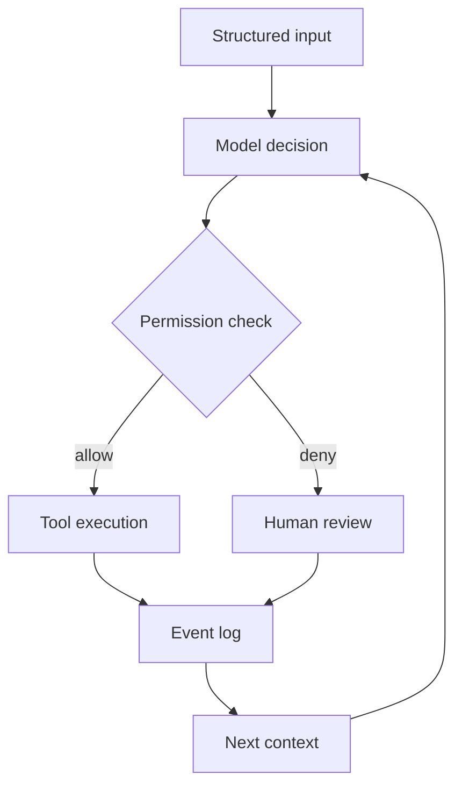

# Architecture

Jarvis is organized around a small kernel that turns a request into explicit
steps. Each step can be inspected, checked against policy, and recorded with
its result.

The boundary is deliberately small: the model proposes an action, the policy
decides whether it may run, and the tool reports what actually happened.
