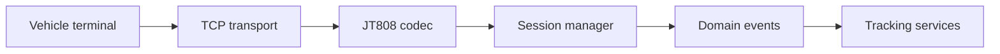

# JT808

JT808 is a protocol toolkit for vehicle positioning and telematics systems.
It turns binary terminal messages into explicit domain events and keeps the
transport, codec, session, and business layers separate.

## Focus

- decode and encode protocol messages with predictable validation;
- manage terminal sessions and acknowledgements;
- expose normalized vehicle events to downstream services;
- make malformed frames and unsupported message types observable.

The project treats the protocol boundary as a reliability boundary: raw bytes
are validated once, then passed to the rest of the system as typed events.
