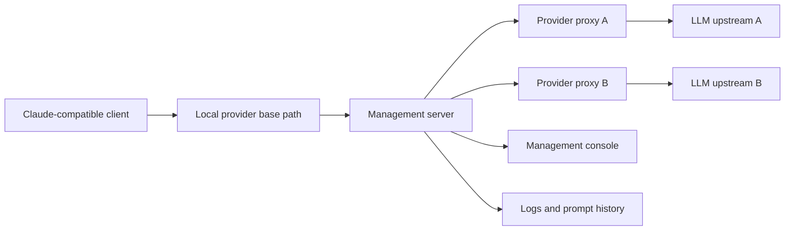

# LLM Proxy

[LLM Proxy](https://github.com/yuanstrong/llm-proxy) is a local TypeScript
proxy manager for routing Claude-compatible clients to multiple configured LLM
providers.

It runs one resident management server and an independent child proxy for each
provider. Clients keep using stable local Anthropic or OpenAI-compatible base
paths while each provider can define its own upstream endpoints, credentials,
model mappings, listen address, and log level.

## What it provides

- Anthropic Messages, OpenAI Chat Completions, and OpenAI Responses routing;
- streaming-safe forwarding of upstream response headers and bodies;
- model-name rewriting when a provider mapping exists;
- HTTP and HTTPS upstream support;
- a browser-based management console for starting and stopping providers;
- provider logs, level filtering, and newest-first prompt history;
- local PID, log, and JSONL history storage under `LLM_PROXY_HOME`;
- macOS LaunchAgent installation, upgrades, rollback, and service checks.

The project is designed to keep provider-specific configuration local and
explicit. A TOML file defines endpoints and model mappings, while the local
console exposes the provider state and the client base URLs needed to connect
tools such as Claude Code or Codex.

## Repository

The source code and development instructions are available on GitHub:

- [github.com/yuanstrong/llm-proxy](https://github.com/yuanstrong/llm-proxy)
