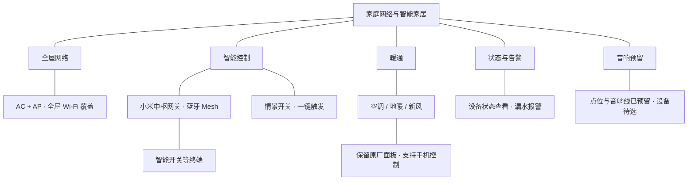

# 构建稳定、可演进的家庭数字底座：全屋智能与网络架构设计总览

写这篇文章的时候，我正在外面度蜜月。家里刚装修、调试完，还没正式入住，远程查看倒是已经用上了：打开手机，能看到空调都关着，新风保持开启，继续给房子通风。漏水报警也已经配好了。

这是装修前就想要的能力。出门以后，不用再回忆某个房间的灯有没有关，也不用因为不放心，找人专门去家里看一眼。

我家是一套 229 平米的叠墅，上下两层，另带地下室。常住的是我和老婆，还有一只小狗。未来会有孩子，父母偶尔也会过来住。做方案时，要考虑的既有眼下两个人怎么用，也有以后家里人多了，大家能不能顺手使用。

装修期间，我们问过不少做全屋智能的公司，有些方案起步就在 5 万到 8 万元。最后我们选择自己做。中间改过方案，也做了不少取舍，如今总算完成了这一阶段的搭建，正好趁细节还记得，把过程整理下来。

这个系列写给同样准备做全屋智能的朋友。第一篇先介绍整体思路：为什么这样规划，各个系统分别负责什么，又怎样配合。具体设备、布线和配置，后面分篇展开。目前还没入住，长期使用的体验，也留到实际住进去以后再补。

## 一、先把想解决的问题说清楚

回头看，我最初的需求其实只有三个。

### 1.1. 出门不用再挨个检查灯和空调

房子有几个楼层，出门前逐层检查设备，是我希望省掉的事情。

为此，家里做了情景模式的开关，用一个按键触发预先配置好的场景。手机也能控制空调、地暖和新风，需要调整时可以直接操作。

对我来说，全屋智能首先得减少这些日常操作。一个本来按一下墙壁开关就能完成的动作，如果每次都要找手机、打开应用、翻到设备页面，反而更麻烦。手机适合远程查看和调整；在家里，顺手的实体按键仍然有它的位置。

以后还会根据生活习惯继续调整场景和自动化。所谓“无感”，也是希望这些小事慢慢不需要惦记，具体能做到哪一步，要住进去才知道。

### 1.2. 网络覆盖到每个需要使用的地方

从楼上到地下室，网络覆盖是这次装修的基础需求。

手机、电脑要用网络，设备远程控制和状态查看也离不开网络。对于这样一套跨楼层的房子，我从一开始就按全屋覆盖来规划，最后采用了 AC + AP 方案。

这里先不展开型号和点位。总览里只需要记住它的职责：把家里的网络接好，让各个区域都有可用的连接。具体怎么布置、怎么配置，值得单独写一篇。

### 1.3. 人不在家，也能知道家里是什么情况

“能控制”和“能看到状态”是两个需求。

我希望打开手机时，能确认设备当前的情况：空调有没有关闭，新风是否还在运行；出现漏水这类异常时，也有相应的报警。

现在外出度蜜月，就已经在使用这部分功能。家里暂时没人住，空调可以关闭，新风则继续保持换气。设备该处于什么状态，跟当下的需要有关，离家也不等于把所有东西都关掉。

如果用一个稍微技术化的词来概括，就是“可观测”。放到日常生活里，就是少一点猜测，需要确认时有地方可看。

## 二、整套系统怎么分工

把全屋智能拆开看，会发现它包含几件不同的事：房子里留好了哪些线路，设备通过什么方式连接，用什么入口控制，以及出了什么情况该提醒人。

下面这张图按职责整理了我家的方案。它是一张总览，分支表示功能归属，不表示实际接线或协议连接。

### 2.1 网络和设备通信，一切互联的基础

首先是全屋组网，由于房子上下3层，为了能在家里随意办公，全屋Wifi的覆盖是必不可少的。Wifi组网最近也出现了很多组网方式，但经过前期调研，我还是使用了经典的AC+AP的组网。

其次是智能设备的互联，这个也有很多协议，例如Zigbee，蓝牙mesh2.0（例如米家），Matter，还是最新的Thread，这套网络以及设备协议的选择之后会单开一篇讲解，由于我们家需要集成的比较多，包括大金的空调，暖通的新风、地暖，各类智能开关，还有窗帘电机，安防摄像头等。我们最终选择的是蓝牙Mesh2.0，采用的生态是米家。

按我家目前的方案，外网中断主要影响手机远程操控和状态查看，家中设备仍然可以使用。这里先点到为止，后面讲网关和设备组网时，再把它们之间的关系拆开。

### 2.2 控制入口要适合使用场景

人在家里时，可以通过开关操作，也可以用情景按键触发一组预先设定的动作。人在外面时，手机承担远程控制和查看的工作。暖通还保留了原厂面板。

这些入口可以同时存在。选哪一种，取决于当时要做什么。

情景模式的作用，是把原本需要分开做的操作组织起来。设备各自能被控制，只是第一步；哪些动作应该一起执行，哪些设备需要保留运行，还得按自己的生活需求去配置。

### 2.3 状态反馈让控制有了下文

一个按键能触发场景，一个应用能发出控制指令，但人在外面时，还会想知道设备现在到底是什么状态。

所以我把状态查看和告警也放进整体规划里。平时可以主动查看，异常情况则通过报警提醒。当前已经做了漏水报警，其他感知设备的选择和配置，后续再详细介绍。

## 三、几个主要子系统的选择

### 3.1 全屋组网：先完成覆盖

我家使用的是 TP-Link 的 AC + AP 套餐，已经完成全屋 Wi-Fi 覆盖。

网络是后续使用的基础，也是装修阶段需要提前安排的一部分。这里的规划要跟实际空间结合：楼层之间怎么连接，设备放在哪里，哪些位置需要网络，后期是否方便维护。

组网篇会沿着这些问题，介绍我家具体怎么做。总览篇先保留这个结果：全屋网络已经搭好，它承担日常上网，以及需要网络连接的设备和服务的通信。

### 3.2 开关与灯光：保留顺手的操作方式

家里的智能开关统一通过蓝牙 Mesh 组网，由小米中枢网关配合使用。情景模式也有实体开关作为触发入口。

灯光是日常操作频率很高的一部分，开关放在哪里、按下去执行什么，直接影响使用感受。家人对全屋智能的接受度很好，但我仍然希望日常操作足够直观。父母偶尔来住，也应该能方便地使用。

这一篇先讲控制方式。灯具、回路和开关怎样搭配，具体场景怎样设置，后面放进灯光篇一起介绍。

### 3.3 暖通：智能控制之外，保留原厂面板

空调、地暖和新风都可以通过手机应用控制，不过我没有把它们的面板全部换成第三方智能面板。

这个选择主要是为了后期维护方便。原厂面板继续保留，需要在现场操作时还有原来的入口；远程查看和控制则通过手机完成。

做全屋智能的过程中，这也是我比较在意的一点：每增加一项功能，都要想一想以后由谁维护、怎么调整。暖通会长期使用，保留熟悉的操作和维护方式，对我来说很有价值。

### 3.4 安防与感知：先关注人不在家时的需要

这部分目前最直接的例子是漏水报警。

全屋智能里有很多让生活更方便的功能，也有一些平时存在感不强，但发生异常时希望它能及时提醒的功能。漏水属于后者，尤其是人长时间不在家的时候。

传感器的意义也在这里：把家里发生的事情转成可以查看的状态，或者可以收到的提醒。后续介绍具体方案时，再分别讨论设备放在哪里、提供什么信息，以及是否需要进一步联动。

### 3.5 音响与多媒体：先留好位置和线

音响目前还没有选定。装修时已经预留了点位和音响线，设备准备后面慢慢挑。

这是整套方案里很明确的一次取舍。房子装修有进度，设备选择却未必能同时做完。对已经确定需要的线路和位置，先完成预留，后续就可以继续比较设备，再决定怎么搭配。

所以音响在当前总览里属于“已预留、待完善”。等真正选好、装好，再写具体的使用和协同。

## 四、这次搭建让我更在意的几件事

### 先明确要省掉什么操作

全屋智能能做的事情很多，装修时很容易顺着设备清单越看越多。我自己的三个需求，一直是判断方案有没有用的依据：离家少检查，网络覆盖完整，人在外面能知道家里的状态。

有了这些具体目标，再去看网关、开关和传感器，会更容易判断它们各自解决哪个问题。

### 把后期维护也算进方案

自己做，就意味着后续也要熟悉这套系统。设备之间怎样连接，场景在哪里调整，哪个部分出问题该从哪里看，都需要心里有数。

保留暖通原厂面板，就是出于这个考虑。全屋智能最终要长期住着用，维护是否方便，会一直影响后面的体验。

我们当时接触到的专业公司报价，有些是 5 万到 8 万元起步。最后选择自己搭建，但这篇暂时不做价格对比：不同方案的设备、施工和服务范围需要先对齐，才有比较的基础。这个系列更想先把自己做的过程讲清楚。

### 装修阶段，把需要提前决定的事情找出来

音响预留是一个现成的例子：设备还可以继续选，线路已经先准备好了。

回头整理装修过程，我会把施工相关的内容单独写出来。开关处的零火线、底盒空间、网线规格、设备点位和检修位置，都会放到对应方案里说明。只列一张“必须预留”的清单还不够，也需要解释每项预留服务于什么设备、什么用法。

### 给入住后的调整留出空间

现在完成的是搭建和调试。情景是否顺手，提醒是否合适，家里人会怎样使用，得在日常生活里慢慢确认。

我希望网络、布线和基本控制先稳定下来，场景可以继续调整，音响这样的子系统也能逐步补齐。这就是标题里“可演进”对我最实际的含义。

## 五、后面准备怎么写

后续会沿着这套已经落地的方案，逐个展开：

| 篇目 | 准备讲清楚的问题 |
| --- | --- |
| 全屋组网 | 多楼层的网络怎样规划，AC + AP 怎么落地，布线、点位和配置分别要考虑什么 |
| 智能开关与灯光 | 蓝牙 Mesh、中枢网关和开关分别做什么，灯光回路与情景怎样配合 |
| 暖通控制 | 空调、地暖和新风如何控制，为什么保留原厂面板，远程使用有哪些实际需求 |
| 安防与感知 | 状态如何查看，漏水等异常如何告警，传感器与场景怎样结合 |
| 音响与多媒体 | 装修时预留了什么，后续怎样选设备、完成搭建 |
| 施工与入住复盘 | 哪些决定需要提前做，方案调整过什么，入住后又发现了哪些问题 |

装修忙完，终于有时间把这些选择重新理一遍。写下来的好处，是能看清每一部分为什么存在，也能给后续调整留个参照。

下一篇就从全屋网络开始，具体聊聊这套上下两层带地下室的房子，是怎样完成网络规划和覆盖的。
